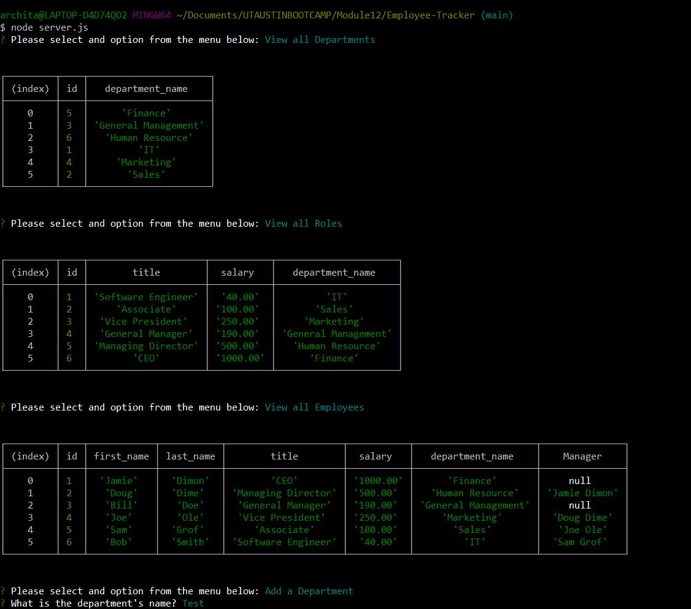

# Employee Tracker

## Purpose

A command-line application to manage a company's employee database, functionalities include View all Departments, View all Roles, View all Employees, Add a Department, Add a Role, Add an Employee, Update an Employee Role, View total utilized budget of a department, Delete Employee and Exit Application.

## Built With

- JavaScript
- Node.js
- Inquirer package
- MySQL2
- console.table package

## Website

Link to walk-through video:
https://drive.google.com/file/d/1d4nRd97_4VthJD6iNz0BJyFbcAv3krWY/view?usp=sharing

## Contribution

Made by Archita
